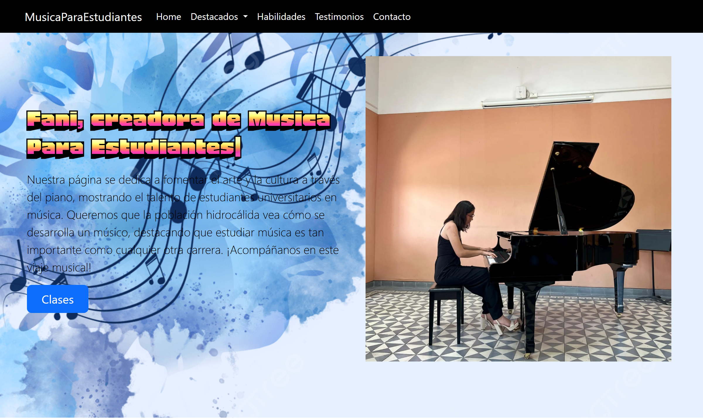
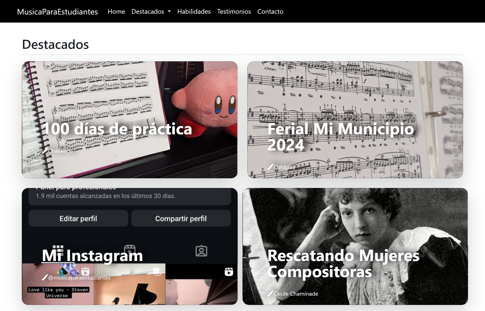
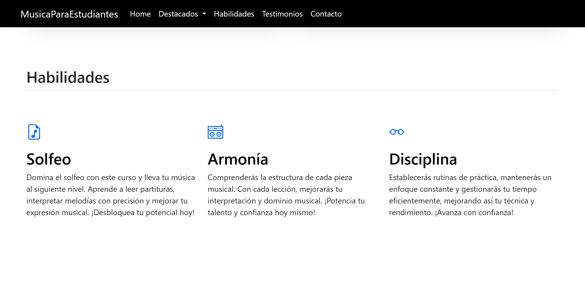
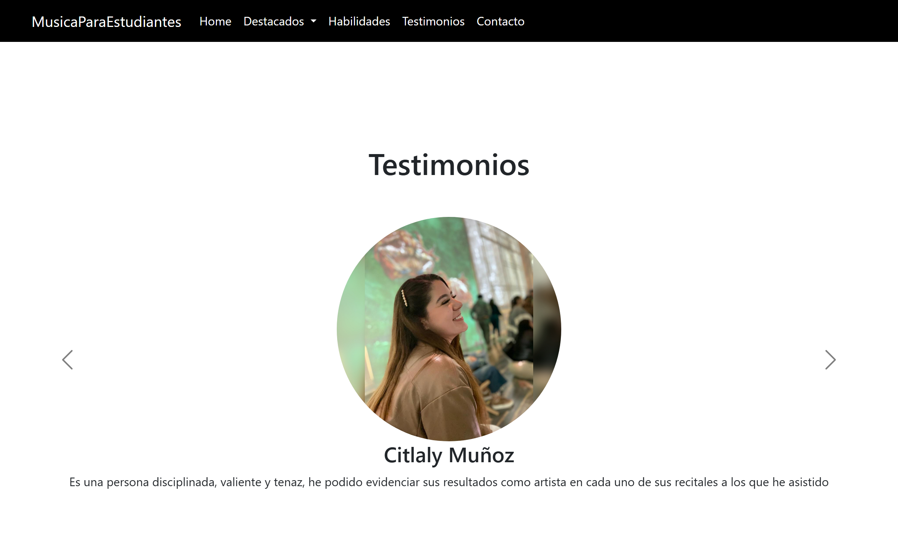
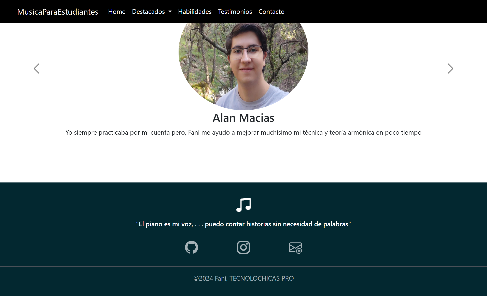

# Mi portafolio de habilidades TECNOLOCHICAS PRO

<h1>El presente proyecto es un portafolio desarrollado para poner en práctica las habilidades obtenidas dentro del bootcamp de desarrollo fontend de Tecnolochicas.</h1>

Fue desarrollado con HTML, CSS y JS con el uso de framework de UI, Boostrap utilizando además bibliotecas externas. 

La página es responsiva (adaptable a diferentes tamaños de pantalla) e incluye la presentación de la autora del proyecto.

[Proyecto desplegado](https://portafoliooficial.netlify.app/)

## Secciones de mi sitio

## Tecnologías

* HTML
* CSS
* Boostrap
* Javascritp

-----
Desarrolado con 💖 por [Fani](https://www.instagram.com/musicaparaestudiantes?igsh=MXc1bzU2cWwxeWUzdw==) en [TECNOLOCHICAS PRO](https://tecnolochicas.mx/)
